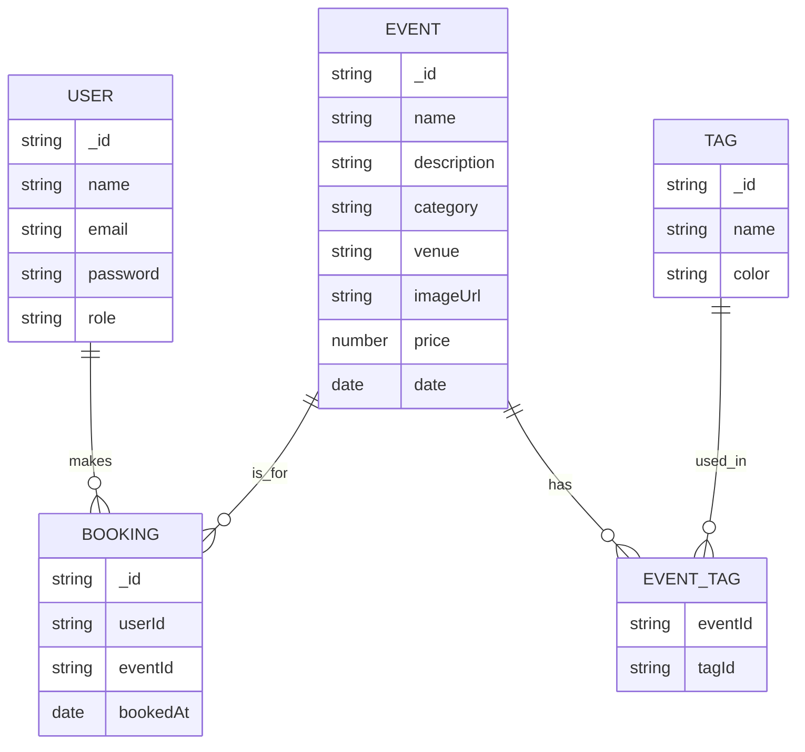

<div align="center">

# 🦆 QuackSeats Backend

</div>


## Data Schema/Models



---

## 🗂️ Backend Structure

The backend follows a clean, scalable architecture:

```
src/
├── controllers/   # Handle HTTP requests & responses
├── models/        # Mongoose schemas & models
├── routes/        # API endpoint definitions
├── services/      # Business logic layer
├── repository/    # Data access layer (DB queries & operations)
├── middlewares/   # Auth, error handling, etc.
├── utils/         # Reusable helpers & contatns
├── config/        # Configuration & DB setup
├── types/         # Shared TypeScript types & interfaces
└── index.js       # Entry point for Express app
```

---

## 🔒 Security Measures

The backend implements several security layers to protect against common vulnerabilities:

- **CORS Protection**: Configurable CORS policy to control cross-origin requests
- **Rate Limiting**: Limits requests to 300 per minute per IP to prevent abuse
- **Helmet**: Sets various HTTP headers for security
- **Request Size Limit**: Limits JSON payload size to 10kb
- **MongoDB Sanitization**: Prevents NoSQL injection attacks
- **XSS Protection**: Sanitizes user input to prevent cross-site scripting attacks

---

## 🚨 Error Handling

The backend implements a robust error handling system with centralized error management:

### Global Error Handler

A global error handler middleware ([`error-handler.middleware.ts`](./src/middlewares/error-handler.middleware.ts)) processes all errors and returns consistent error responses:

```ts
// Example error response format
{
    statusCode: number,
    message: string
}
```

### Mongoose Error Handling

Specialized handling for common Mongoose errors, inspired by [Sling Academy's guide](https://www.slingacademy.com/article/how-to-handle-errors-in-mongoose-an-in-depth-guide/):

- **Validation Errors**: Schema validation failures
- **Cast Errors**: Invalid ObjectId or type mismatches
- **Duplicate Key Errors**: Unique index violations

```ts
// Example: Handling Mongoose errors
try {
    await user.save();
} catch (error) {
    const response = handleMongooseError(error);
    // Returns formatted error response
}
```

### Custom Error Classes

The system uses custom error classes for different scenarios:

- `AppError`: Base error class for application errors
- `DatabaseError`: Database-specific errors
- `ValidationError`: Input validation errors
- `NotFoundError`: Resource not found errors

---

## 🏗️ Repository Pattern & Atomic Transactions

### Generic Repository for Mongoose

To promote code reuse and consistency, I implement a **generic repository class** for common Mongoose operations (CRUD). This approach is inspired by [this article](https://medium.com/@erickwendel/generic-repository-with-typescript-and-node-js-731c10a1b98e).

> **Snapshot:**  
> See [`src/types/repository.ts`](./src/types/repository.ts)
> ```ts
> export abstract class BaseRepository<T extends Document> {
>   protected model: Model<T>;
>   constructor(model: Model<T>) { this.model = model; }
>   async create(item: Partial<T>): Promise<T> { return this.model.create(item); }
> }
> ```

This pattern allows all repositories to inherit common logic, reducing duplication and improving maintainability.

---

### Atomic Operations with Transactions

I use an **atomic approach** for database operations: either all changes succeed, or none are applied. This is achieved by wrapping requests in a MongoDB transaction using a middleware.

> **Snapshot:**  
> See [`src/middlewares/transaction.middleware.ts`](./src/middlewares/transaction.middleware.ts)
> ```ts
> export const transactionMiddleware = (req, _, next) => {
>   mongoose.startSession().then((session) => {
>     session.startTransaction();
>     req.session = session;
>     next();
>   });
> };
> ```

This ensures data consistency and integrity, especially for multi-step operations.

---

## 🧩 Request Validation with Zod (DTO-like)

To ensure robust and type-safe validation of incoming requests, this project uses [Zod](https://zod.dev/) schemas. Zod acts as a runtime validator and can serve as a replacement for traditional DTOs (Data Transfer Objects) found in frameworks like Java Spring or NestJS.

**Example: User DTO Validation with Zod**

```ts
// src/types/dtos/user.dto.ts
import { UserRoleEnum } from '../enums';
import { z } from 'zod';

export const CreateUserSchema = z.object({
  name: z
    .string()
    .min(3, "Name must be at least 3 characters long")
    .max(50, "Name must be less than 50 characters")
    .regex(/^[a-zA-Z\s'-]+$/, "Name can only contain letters, spaces, hyphens, and apostrophes"),
  email: z
    .string()
    .email("Please enter a valid email address"),
  password: z
    .string()
    .min(8, "Password must be at least 8 characters long")
    .max(32, "Password must be less than 32 characters")
    .regex(
      /^(?=.*[a-z])(?=.*[A-Z])(?=.*\d)(?=.*[@$!%*?&])[A-Za-z\d@$!%*?&]{8,}$/,
      "Password must contain at least one uppercase letter, one lowercase letter, one number, and one special character"
    ),
  role: z.literal(UserRoleEnum.USER),
});
```

---

## 🏷️ Experimental Decorators (Inspired by Java Spring & NestJS)

Inspired by technologies I use in university and industry—such as **Java Spring** (where they're called "annotations") and **NestJS** (where they're called "decorators")—I decided to experiment with TypeScript's.

**Example: Database Error Handling Decorator**

```ts
import { DatabaseError } from "@/utils/error/DatabaseError";

export function WrapDatabaseError(
  target: any,
  propertyKey: string,
  descriptor: PropertyDescriptor
) {
  const originalMethod = descriptor.value;
  descriptor.value = async function (...args: any[]) {
    try {
      return await originalMethod.apply(this, args);
    } catch (error: any) {
      throw new DatabaseError(error);
    }
  };
  return descriptor;
}
```

Use this decorator on repository methods to automatically catch and wrap any thrown errors:

```ts
class UserRepository {
  @WrapDatabaseError
  async createUser(data: CreateUserDto) {
    // ... database logic ...
  }
}
```

> **Reference:** [TypeScript Decorators Handbook](https://www.typescriptlang.org/docs/handbook/decorators.html)