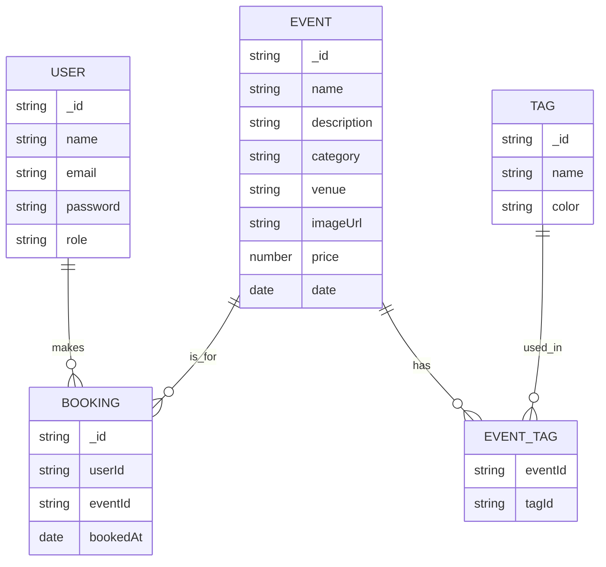

<div align="center">

# 🦆 QuackSeats Backend

</div>


## Data Schema/Models



---

## 🗂️ Backend Structure

The backend follows a clean, scalable architecture:

```
src/
├── controllers/   # Handle HTTP requests & responses
├── models/        # Mongoose schemas & models
├── routes/        # API endpoint definitions
├── services/      # Business logic layer
├── repository/    # Data access layer (DB queries & operations)
├── middlewares/   # Auth, error handling, etc.
├── utils/         # Reusable helpers & contatns
├── config/        # Configuration & DB setup
├── types/         # Shared TypeScript types & interfaces
└── index.js       # Entry point for Express app
```

---

## 🔒 Security Measures

The backend implements several security layers to protect against common vulnerabilities:

- **CORS Protection**: Configurable CORS policy to control cross-origin requests
- **Rate Limiting**: Limits requests to 300 per minute per IP to prevent abuse
- **Helmet**: Sets various HTTP headers for security
- **Request Size Limit**: Limits JSON payload size to 10kb
- **MongoDB Sanitization**: Prevents NoSQL injection attacks
- **XSS Protection**: Sanitizes user input to prevent cross-site scripting attacks

---

## 🏗️ Repository Pattern & Atomic Transactions

### Generic Repository for Mongoose

To promote code reuse and consistency, I implement a **generic repository class** for common Mongoose operations (CRUD). This approach is inspired by [this article](https://medium.com/@erickwendel/generic-repository-with-typescript-and-node-js-731c10a1b98e).

> **Snapshot:**  
> See [`src/types/repository.ts`](./src/types/repository.ts)
> ```ts
> export abstract class BaseRepository<T extends Document> {
>   protected model: Model<T>;
>   constructor(model: Model<T>) { this.model = model; }
>   async create(item: Partial<T>): Promise<T> { return this.model.create(item); }
> }
> ```

This pattern allows all repositories to inherit common logic, reducing duplication and improving maintainability.

---

### Atomic Operations with Transactions

I use an **atomic approach** for database operations: either all changes succeed, or none are applied. This is achieved by wrapping requests in a MongoDB transaction using a middleware.

> **Snapshot:**  
> See [`src/middlewares/transaction.middleware.ts`](./src/middlewares/transaction.middleware.ts)
> ```ts
> export const transactionMiddleware = (req, _, next) => {
>   mongoose.startSession().then((session) => {
>     session.startTransaction();
>     req.session = session;
>     next();
>   });
> };
> ```

This ensures data consistency and integrity, especially for multi-step operations.