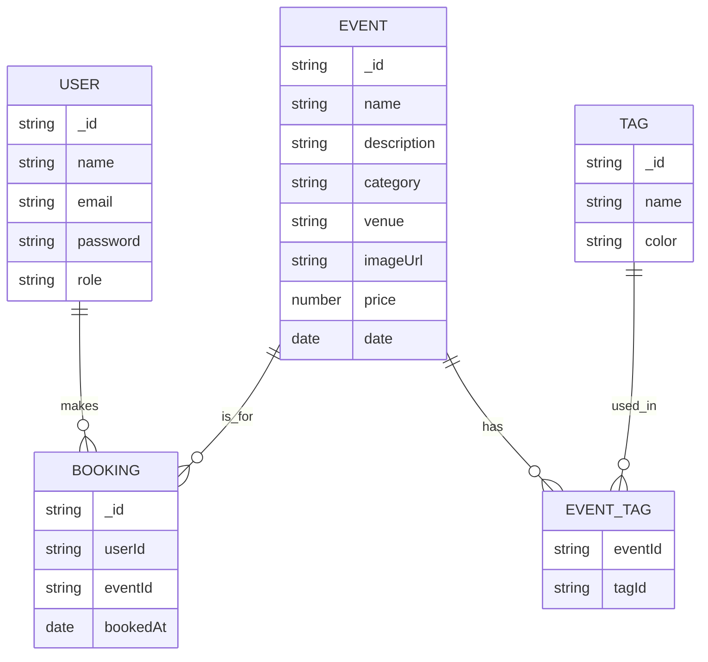

# 🦆 QuackSeats Backend

## Data Schema/Models
4. 


---

## 🗂️ Backend Structure

The backend follows a clean, scalable architecture:

```
src/
├── controllers/   # Handle HTTP requests & responses
├── models/        # Mongoose schemas & models
├── routes/        # API endpoint definitions
├── services/      # Business logic layer
├── repository/    # Data access layer (DB queries & operations)
├── middlewares/   # (Optional) Auth, error handling, etc.
├── utils/         # Reusable helpers & contatns
├── config/        # Configuration & DB setup
├── types/         # Shared TypeScript types & interfaces
└── index.js       # Entry point for Express app
```

---

## 🔒 Security Measures

The backend implements several security layers to protect against common vulnerabilities:

- **CORS Protection**: Configurable CORS policy to control cross-origin requests
- **Rate Limiting**: Limits requests to 300 per minute per IP to prevent abuse
- **Helmet**: Sets various HTTP headers for security
- **Request Size Limit**: Limits JSON payload size to 10kb
- **MongoDB Sanitization**: Prevents NoSQL injection attacks
- **XSS Protection**: Sanitizes user input to prevent cross-site scripting attacks