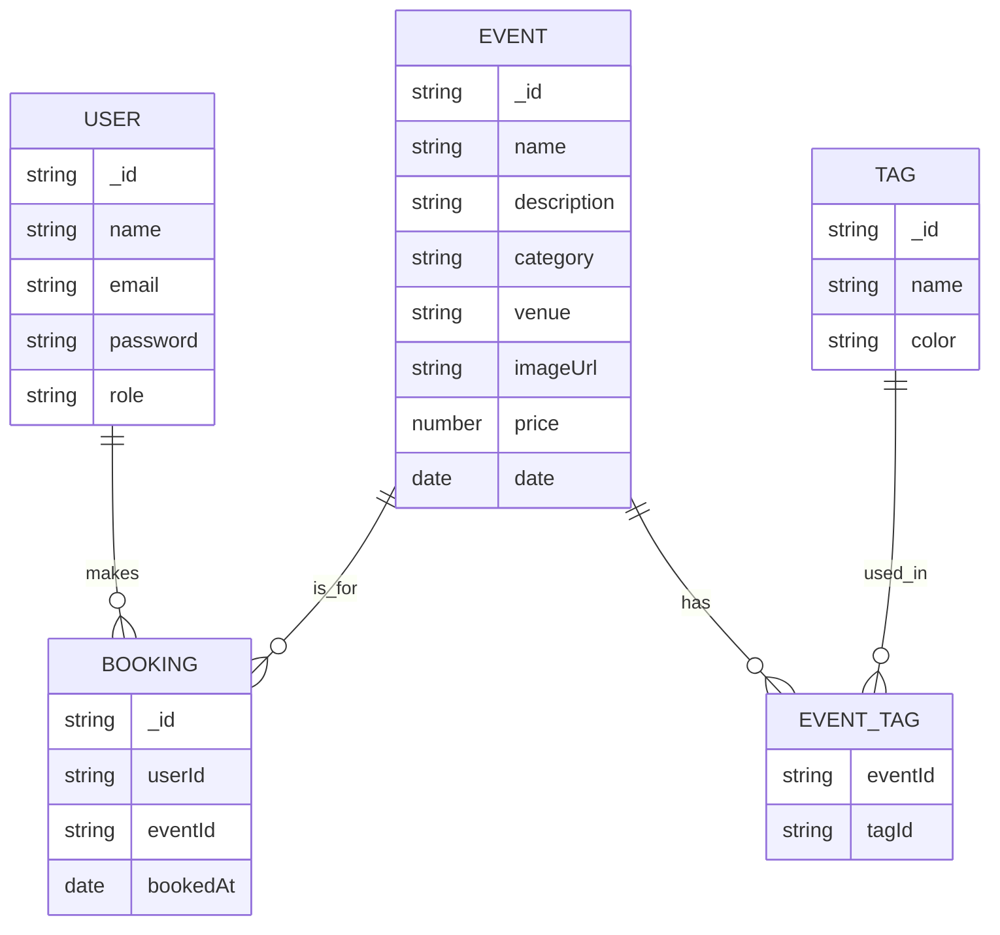

# 🦆 QuackSeats

**QuackSeats** is a full-stack event booking platform where users can discover and reserve events, manage their bookings, and admins can oversee everything through a sleek web-based dashboard.

## Features

* event browsing & booking
* Personal booking management
* Admin panel for event control
* Fully responsive across devices
* Dark mode toggle support & A duck-themed loyalty badge system!
* Multi-language support (English, Arabic)

## 🧱 Tech Stack

| Layer      | Tech                                                 |
| ---------- | ---------------------------------------------------- |
| Frontend   | React + Tailwind CSS + DaisyUI + **Redux Toolkit** |
| Backend    | Node.js + Express                                    |
| Database   | MongoDB (via Mongoose)                               |
| Auth       | JWT-based auth with role support                     |
| Deployment | **AWS (EC2)**        |

## Data Schema/Models
4. 

